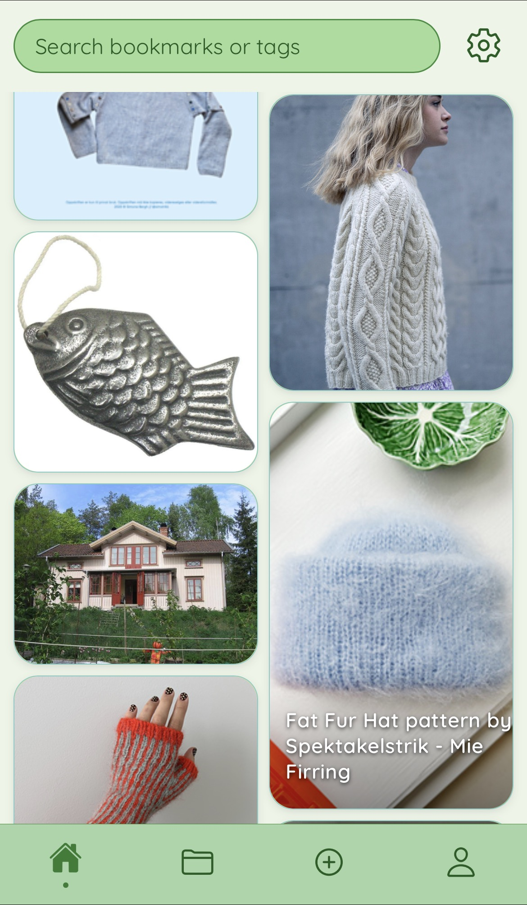
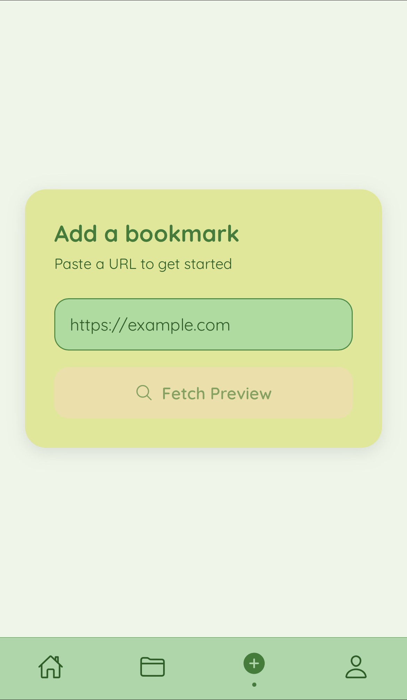
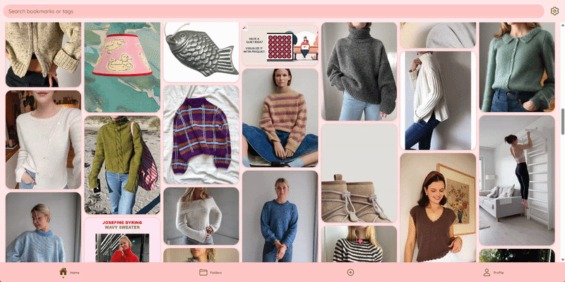

# Bookit
A visual bookmark app where you can save, organise, and share bookmarks on the go.

## Description
Like a merge of Pinterest and Mindler, you can save and organise your bookmarks in a dynamic grid. Bookmarks can be tagged, saved to folders, hidden, and shared with friends and family. This is not so much an app for an aesthetic feed, but for aesthetically organising all of those links and cool things you come across on a daily basis.

## Screenshots

 

## Demo




## Features
- Pinterest-style masonry grid with dynamic aspect ratio cards
- Automatic metadata fetching (title, image, description) from any URL
- Manual image upload when automatic fetch isn't available
- Multi-folder support — save a bookmark to multiple folders simultaneously
- Tag-based search
- Shuffle on load — fresh layout every session
- Profile sharing with accept/deny flow
- Folder-level sharing permissions
- Persistent user blocking
- Five themes (Light, Dark, Pink, Green, Orange)
- Responsive layout — works on web, mobile browser, iOS and Android

## Tech Stack
- React Native + Expo
- Supabase (PostgreSQL, Auth, Storage, RLS)
- Netlify (hosting + serverless metadata function)

## Security
- Row Level Security on all tables
- Private storage bucket — images never publicly accessible
- SSRF protection on metadata fetch function
- Rate limiting on serverless function
- Email enumeration protection
- Persistent user blocking at database level
- Environment variables for all secrets

## Self-Hosting

1. Clone the repo
   `git clone https://github.com/nicoh/bookit.git`

2. Install dependencies
   `npm install`

3. Set up your Supabase database
   - Go to your Supabase project → SQL Editor
   - Open each file in the /sql folder in order (01 first, 09 last)
   - Paste the contents into the SQL editor and click Run
   - Do this for each file in order

4. Create a Netlify account at https://netlify.com
   - Connect your repo
   - Deploy the `netlify/functions/fetch-metadata.js` function

5. Create a `.env` file in the project root:
```
   EXPO_PUBLIC_SUPABASE_URL=your_supabase_project_url
   EXPO_PUBLIC_SUPABASE_ANON=your_supabase_anon_key
```

6. Run the app
   `npx expo start`

## SQL Migrations
| # | File | Description |
|---|---|---|
| 01 | `01_add_image_dimensions` | Adds width/height columns for aspect ratio rendering |
| 02 | `02_create_bookmark_folders` | Junction table for many-to-many folder relationships |
| 03 | `03_add_sharing_status` | Adds accept/deny flow to shared permissions |
| 04 | `04_sharing_system` | Full sharing system, RLS policies, RPC functions |
| 05 | `05_storage_and_image_path` | Private storage bucket and image_path column |
| 06 | `06_add_folder_hidden_position` | Folder visibility and ordering |
| 07 | `07_blocked_users` | Persistent blocking table and RPC functions |
| 08 | `08_fix_email_enumeration` | Hardens share function against email enumeration |
| 09 | `09_fix_bookmarks_viewer_policy` | Restores safe bookmarks viewer policy with owner access guaranteed |

## Known Limitations
- Folder-level sharing restrictions are not yet enforced at the database level — shared viewers currently see all bookmarks regardless of folder permissions selected

## Roadmap
- Fix folder-level RLS policy for shared viewers
- Native mobile distribution (App Store / Play Store)
- Collaborative folders
- Browser extension for one-click bookmarking
- Public profiles
- Import from browser bookmarks
